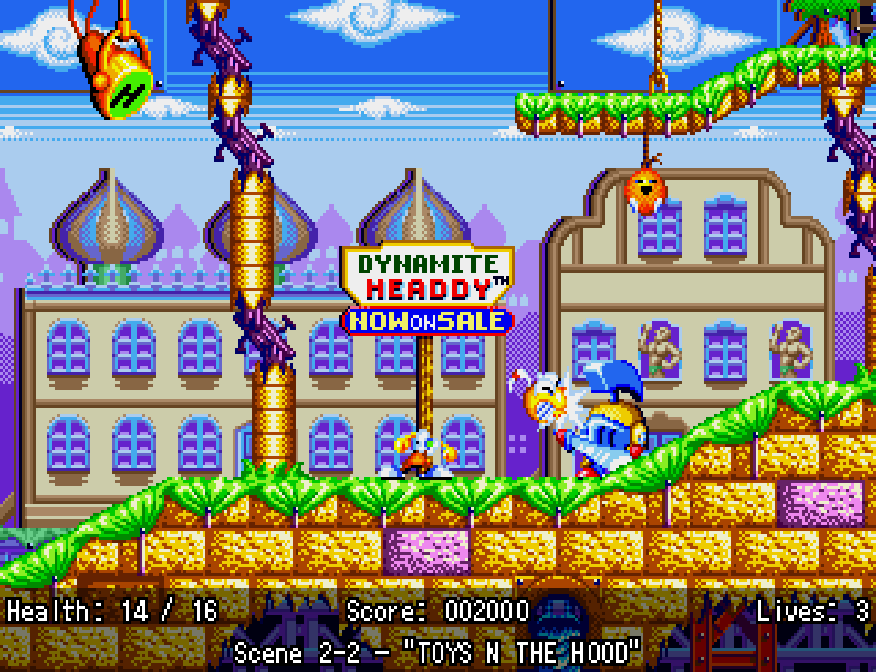
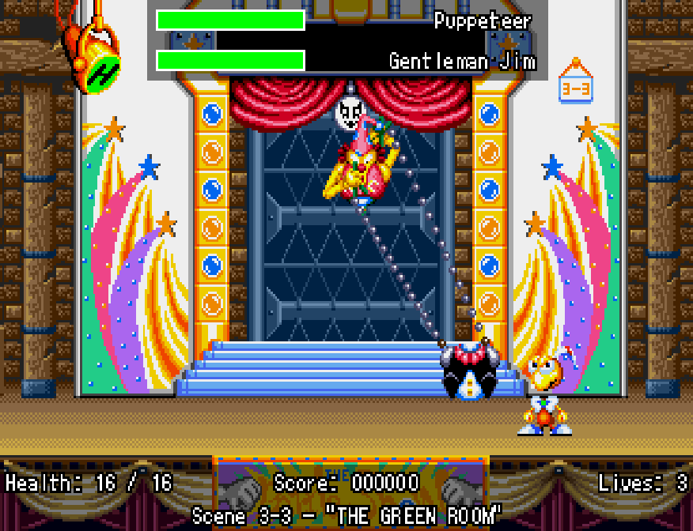
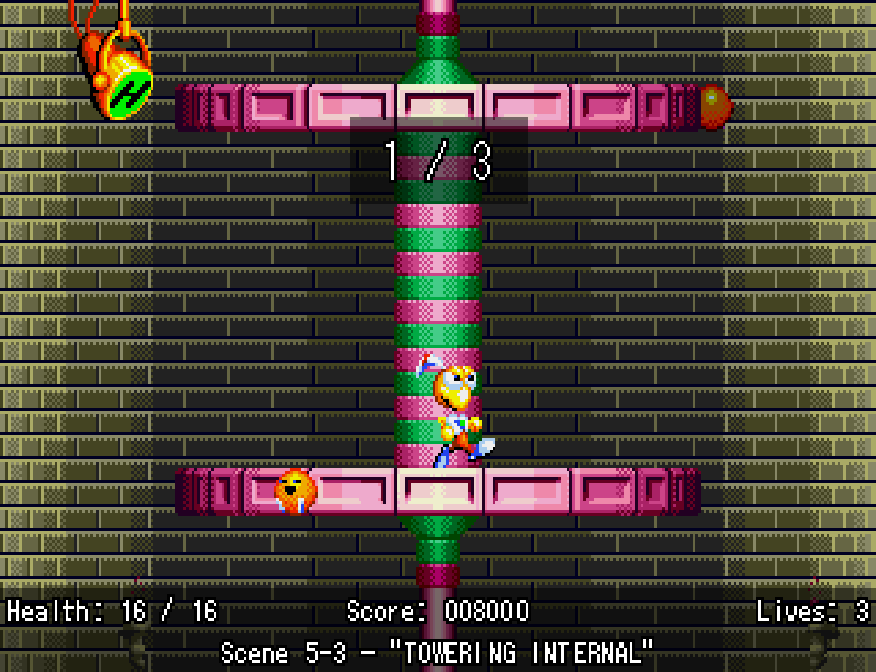
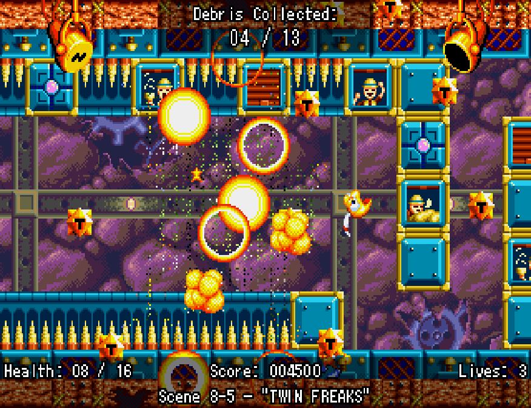
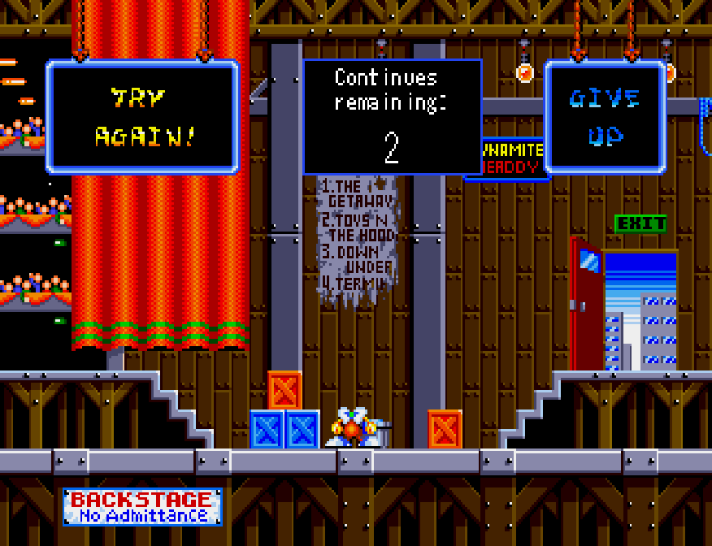
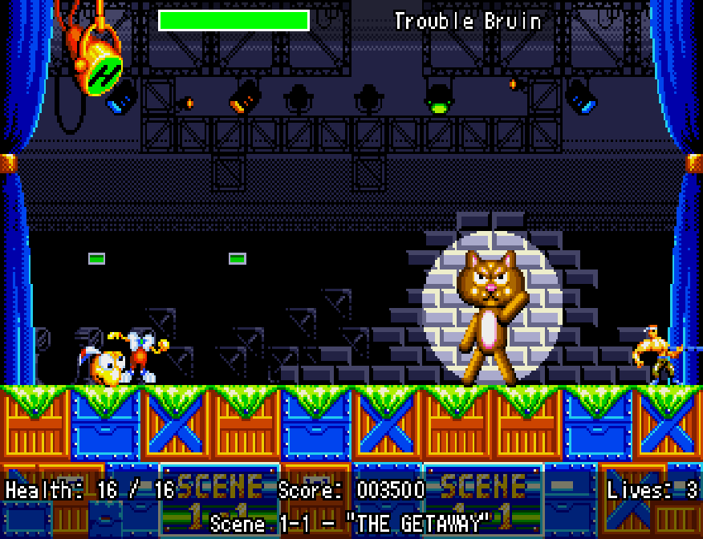
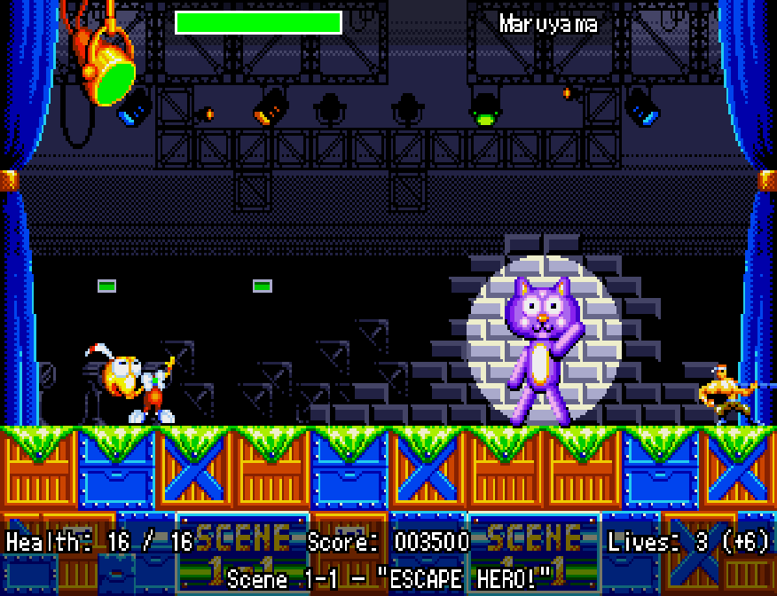
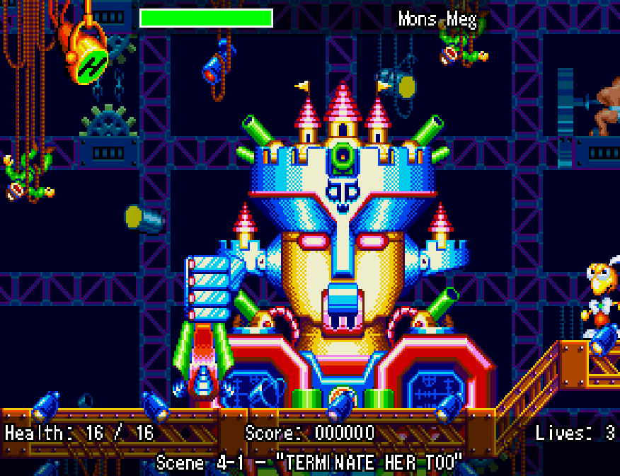
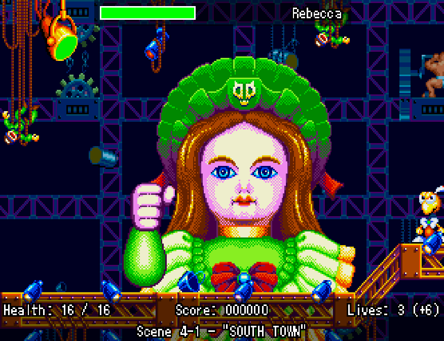

# HeaddyOverlay
A HUD overlay script for _Dynamite Headdy_, written for [**BizHawk**](https://github.com/TASEmulators/BizHawk).

## Supported ROMs
| Title | Hash |
| - | - |
| _Dynamite Headdy_ (UE) | `D11EC9B230E88403CD75EF186A884C97` (MD5) |
| _Dynamite Headdy_ (J) | `CDB36911439289D3453060F58682057C` (MD5) |
| _Dynamite Headdy_ (J), [MIJET fan translation patch v. 070428](https://archive.org/details/dynamite-headdy-jap-eng-translation) | `241D076E6CAF02496A916AF30C009A5279E0832E` (SHA1) |

## Features
- A small HUD that displays:
  - Headdy's health, as a numerical value
  - Total score
  - Remaining lives (including extra lives from continues)
  - The current level name

- Dynamic health bars for bosses, including mid-level bosses

- A small, per-scene "Secret Bonus Point" counter

- A counter for debris collection after end-of-Scene bosses

- A custom UI element for displaying remaining continues on the "Game Over" map in the international version of the game

- Automatic setting of names and values depending on what version of the game you're playing

| _Dynamite Headdy_ (UE) | _Dynamite Headdy_ (J) |
| :-: | :-: |
|  |  |
|  |  |

- And more smaller stuff not mentioned here

## Known Issues
- Rewinding can cause desynchronisations between the game and the overlay's UI elements -- these can be fixed by updating the value tied to the element in-game (eg. taking damage when the Health portion is desynced), or by reloading the script entirely via the Lua Console
